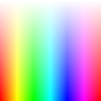

# CraftShader

A simple fragment shader renderer for ComputerCraft.

## What's In The Box

- Fragment shaders written in Lua
- Basic framebuffer implementation
- Color & Vector math
- Quantization (median cut paletting w/ euclidian color distance)

## Average Performance

Performance varies heavily depending on what your shader does and what resolution you are rendering at, but most non-complex shaders on a standard sized ComputerCraft resolution can average 25+ fps. Many simpler shaders can even reach shading speeds of 50 fps. It won't struggle with quantizing static images quickly by any means.

## Further Plans

There are plans to implement ComputerCraft's teletext characters and dithering at some point, and it should be simple to just downscale a higher resolution framebuffer to fit teletext and running a second shader for a dither pass.

## Screenshots

